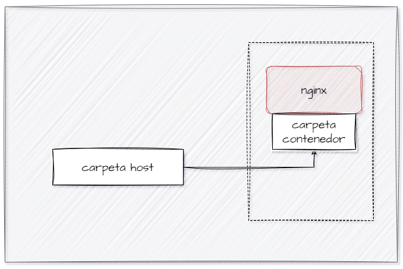
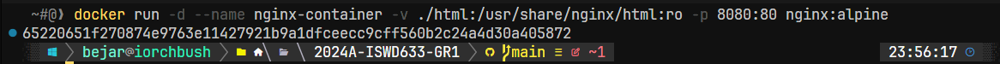
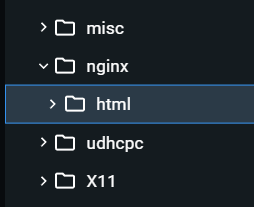
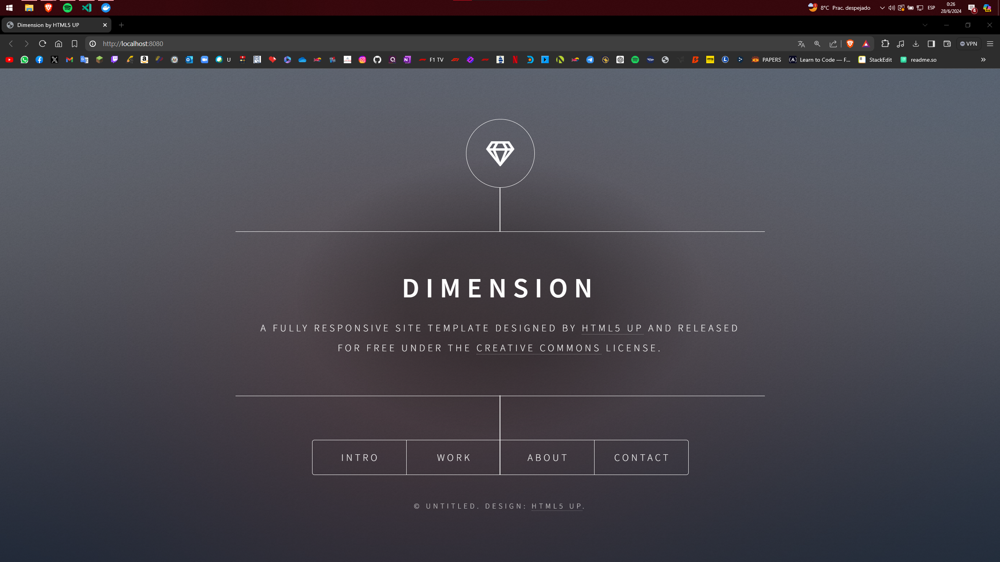
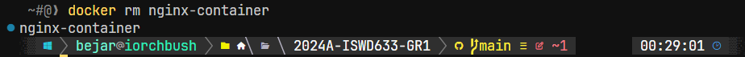
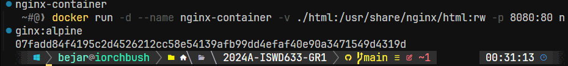
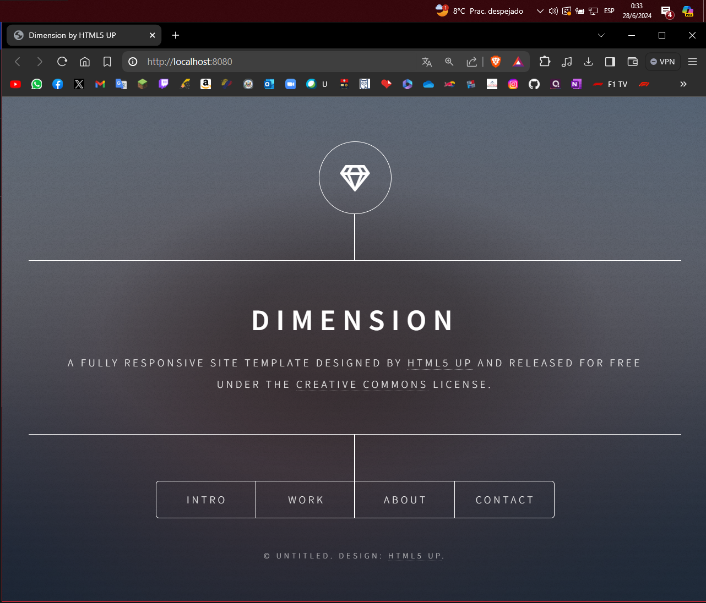

# VOLUMEN TIPO HOST
Un volumen host (o bind mount) es un tipo de volumen donde se monta un directorio o archivo específico del sistema de archivos del host en un contenedor.

```bash
docker run -d --name <nombre contenedor> -v <ruta carpeta host>:<ruta carpeta contenedor> <imagen> 
```

### Crear un volumen tipo host con la imagen nginx:alpine, para la ruta carpeta host: directorio en donde se encuentra la carpeta html en tu computador y para la ruta carpeta contenedor: /usr/share/nginx/html esta ruta se obtiene al revisar la se obtiene desde la documentación



```bash
docker run -d --name nginx-container -v ./html:/usr/share/nginx/html:rw -p 8080:80 nginx:alpine
```



### ¿Qué sucede al ingresar al servidor de nginx?
Al ingresar al servidor Nginx (por ejemplo, visitando `http://localhost:8080` en el navegador), Nginx mostrará el contenido del directorio /usr/share/nginx/html en el contenedor, que se vincula a través de un volumen montado desde /path/to/your/html en el host. Si falta un archivo index.html en esta ubicación, Nginx puede mostrar un error o un listado de directorios, según su configuración.

### ¿Qué pasa con el archivo index.html del contenedor?
No hay, está vacío.




### Ir a https://html5up.net/ y descargar un template gratuito, descomprirlo dentro de nginx/html
### ¿Qué sucede al ingresar al servidor de nginx?

Se colocan los elementos de la carpeta de la página web que fue montada.



### Eliminar el contenedor
```bash
docker rm nginx-container
```



### ¿Qué sucede al crear nuevamente el mismo contenedor con volumen de tipo host a los directorios definidos anteriormente?

Los archivos se quedan.

```bash
docker run -d --name nginx-container -v ./html:/usr/share/nginx/html:rw -p 8080:80 nginx:alpine
```





### ¿Qué hace el comando pwd?

Muestra da la dirección de la ruta actual.

Si quieres incluir el comando pwd dentro de un comando de Docker, lo puedes hacer de diferentes maneras dependiendo del shell que estés utilizando.


### Volumen tipo host usando PWD y PowerShell
```powershell
docker run -d --name <nombre contenedor> --publish published=<valorPuertoHost>,target=<valor> -v ${PWD}/<ruta relativa>:<ruta absoluta> <nombre imagen>:<tag> 
```

### Volumen tipo host usando PWD (Git Bash)

```bash
docker run -d --name <nombre contenedor> --publish published=<valorPuertoHost>,target=<valor> -v $(pwd -W)/html:/usr/share/nginx/html <nombre imagen>:<tag> 
```

### Volumen tipo host usando PWD (en Linux)

```bash
docker run -d --name <nombre contenedor> --publish published=<valorPuertoHost>,target=<valor> -v $(pwd)/html:/usr/share/nginx/html <nombre imagen>:<tag> 
```