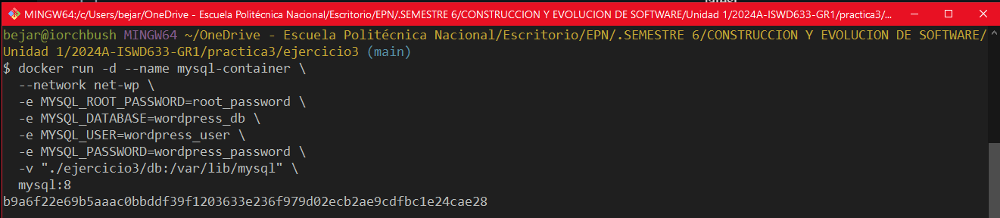
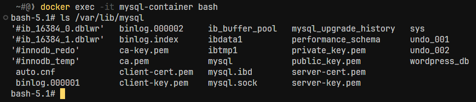
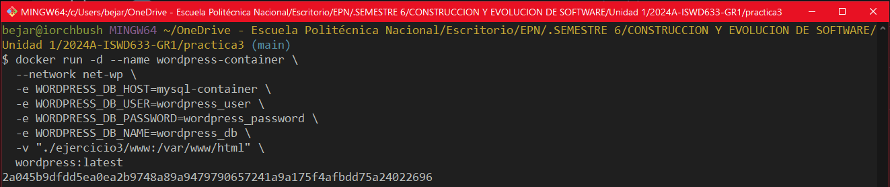
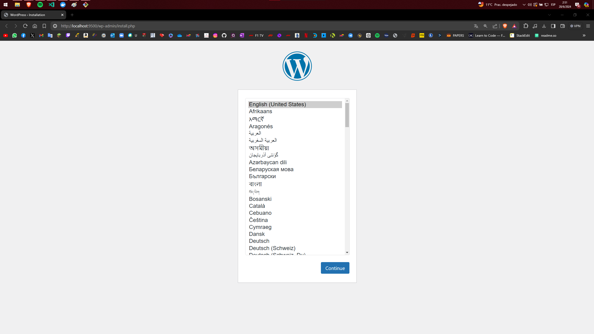
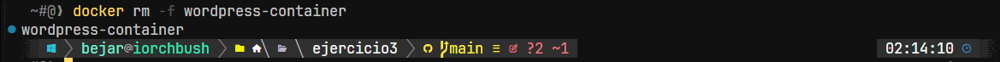

## Esquema para el ejercicio


### Crear red net-wp

```bash
docker network create net-wp
```


### Para que persista la información es necesario conocer en dónde mysql almacena la información.

En el esquema del ejercicio la carpeta contenedor (a) es /var/lib/mysql

### ¿Qué contiene la carpeta db del host?

Dado que la carpeta db en el host está montada en /var/lib/mysql en el contenedor de MySQL, y esta carpeta es donde MySQL almacena todos sus datos, después de que el contenedor esté en ejecución y se haya inicializado, encontrarás archivos de bases de datos MySQL en esta carpeta.

### Crear un contenedor con la imagen mysql:8  en la red net-wp, configurar las variables de entorno: MYSQL_ROOT_PASSWORD, MYSQL_DATABASE, MYSQL_USER y MYSQL_PASSWORD



```bash
docker run -d --name mysql-container \
  --network net-wp \
  -e MYSQL_ROOT_PASSWORD=root_password \
  -e MYSQL_DATABASE=wordpress_db \
  -e MYSQL_USER=wordpress_user \
  -e MYSQL_PASSWORD=wordpress_password \
  -v "./ejercicio3/db:/var/lib/mysql" \
  mysql:8
```


### ¿Qué observa en la carpeta db que se encontraba inicialmente vacía?

Después de iniciar el contenedor de MySQL, observarás que la carpeta db ya no está vacía. Ahora contiene los archivos de la base de datos de MySQL que manejan el almacenamiento de datos para tu aplicación, lo que asegura la persistencia de la información.

### Para que persista la información es necesario conocer en dónde wordpress almacena la información.

Para completar la información sobre dónde WordPress almacena sus datos dentro de un contenedor Docker, es importante consultar la documentación oficial de la imagen de WordPress en Docker Hub. Según la documentación de la imagen oficial de WordPress:

WordPress almacena sus datos en el directorio /var/www/html dentro del contenedor. Este directorio incluye los archivos PHP de WordPress, así como los temas, plugins y subidas de archivos.

En el esquema del ejercicio la carpeta contenedor (b) es /var/www/html

### Crear un contenedor con la imagen wordpress en la red net-wp, configurar las variables de entorno WORDPRESS_DB_HOST, WORDPRESS_DB_USER, WORDPRESS_DB_PASSWORD y WORDPRESS_DB_NAME (los valores de estas variables corresponden a los del contenedor creado previamente)



```bash
docker run -d --name wordpress-container \
  --network net-wp \
  -e WORDPRESS_DB_HOST=mysql-container \
  -e WORDPRESS_DB_USER=wordpress_user \
  -e WORDPRESS_DB_PASSWORD=wordpress_password \
  -e WORDPRESS_DB_NAME=wordpress_db \
  -v "./ejercicio3/www:/var/www/html" \
  wordpress:latest
```

### Personalizar la apariencia de wordpress y agregar una entrada



### Eliminar el contenedor y crearlo nuevamente, ¿qué ha sucedido?

```bash
docker rm -f wordpress-container
```


```bash
docker run -d --name wordpress-container \
  --network net-wp \
  -e WORDPRESS_DB_HOST=mysql-container \
  -e WORDPRESS_DB_NAME=wordpress_db \
  -e WORDPRESS_DB_USER=wordpress_user \
  -e WORDPRESS_DB_PASSWORD=wordpress_password \
  -v "./ejercicio3/www:/var/www/html" \
  -p 9500:80 \
  wordpress:latest
```
Al volver a crear el contenedor de WordPress:

La persistencia de datos en aplicaciones Dockerizadas, como WordPress, se logra almacenando configuraciones y publicaciones en volúmenes montados: los archivos de WordPress en la carpeta www del host y la base de datos en la carpeta db. Esto permite que los datos se mantengan seguros y accesibles, incluso si los contenedores son eliminados y recreados, garantizando así la continuidad del servicio y la integridad de los datos.