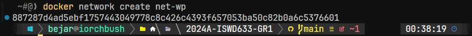

## Esquema para el ejercicio


### Crear red net-wp

```bash
docker network create net-wp
```



### Para que persista la información es necesario conocer en dónde mysql almacena la información.

En el esquema del ejercicio la carpeta contenedor (a) es /var/lib/mysql

### ¿Qué contiene la carpeta db del host?

Dado que la carpeta db en el host está montada en /var/lib/mysql en el contenedor de MySQL, y esta carpeta es donde MySQL almacena todos sus datos, después de que el contenedor esté en ejecución y se haya inicializado, encontrarás archivos de bases de datos MySQL en esta carpeta.

### Crear un contenedor con la imagen mysql:8  en la red net-wp, configurar las variables de entorno: MYSQL_ROOT_PASSWORD, MYSQL_DATABASE, MYSQL_USER y MYSQL_PASSWORD

```bash
docker run -d --name mysql-container \
  --network net-wp \
  -e MYSQL_ROOT_PASSWORD=root_password \
  -e MYSQL_DATABASE=wordpress_db \
  -e MYSQL_USER=wordpress_user \
  -e MYSQL_PASSWORD=wordpress_password \
  -v "$(pwd)/ejercicio3/db:/var/lib/mysql" \
  mysql:8

```

### ¿Qué observa en la carpeta db que se encontraba inicialmente vacía?
# COMPLETAR CON LA RESPUESTA A LA PREGUNTA

### Para que persista la información es necesario conocer en dónde wordpress almacena la información.
# COMPLETAR LA SIGUIENTE ORACIÓN. REVISAR LA DOCUMENTACIÓN DE LA IMAGEN EN https://hub.docker.com/)
En el esquema del ejercicio la carpeta contenedor (b) es (COMPLETAR CON LA RUTA)
Ruta carpeta host: .../ejercicio3/www

### Crear un contenedor con la imagen wordpress en la red net-wp, configurar las variables de entorno WORDPRESS_DB_HOST, WORDPRESS_DB_USER, WORDPRESS_DB_PASSWORD y WORDPRESS_DB_NAME (los valores de estas variables corresponden a los del contenedor creado previamente)
# COMPLETAR CON EL COMANDO

### Personalizar la apariencia de wordpress y agregar una entrada

### Eliminar el contenedor y crearlo nuevamente, ¿qué ha sucedido?

# COMPLETAR CON LA RESPUESTA A LA PREGUNTA


